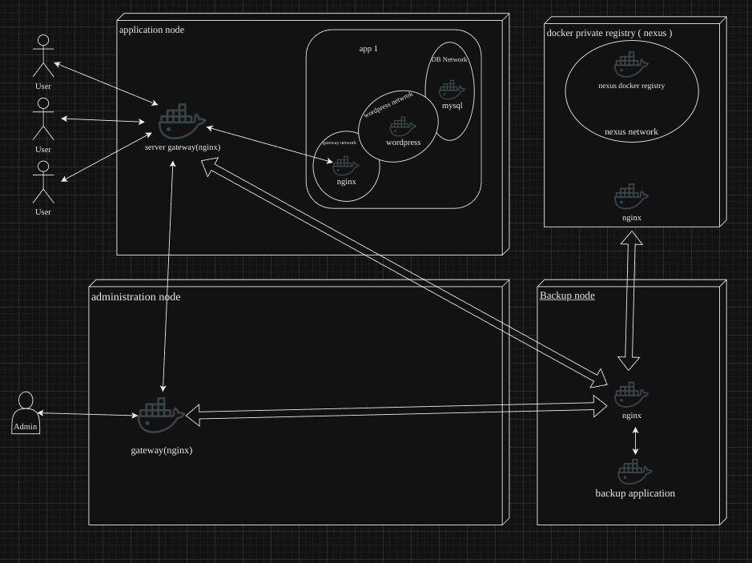

# nephew-5 project 

## project is live at (http://nephews5.store)

since the master of class nickname was uncle and our team was made of 5 person , we deside to name this project to nephews-5
this is how the project was suppose be structured but due to different reasons, unfortunately we couldn't manage to make it perfect

each section of project has a separated repository
* app: this repo contains wordpress application (nginx is used as server for wordpress)
* gateway: nginx server used as a gateway for application node,
* docs: shows a big picture of how nephews-5 is structured

each repo has it's own docs
